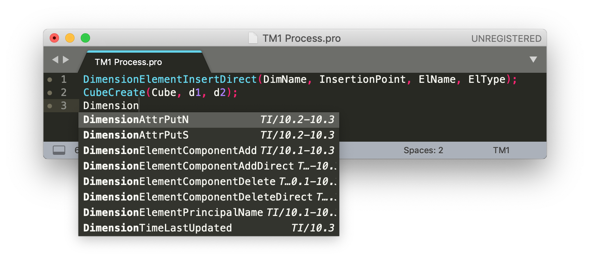
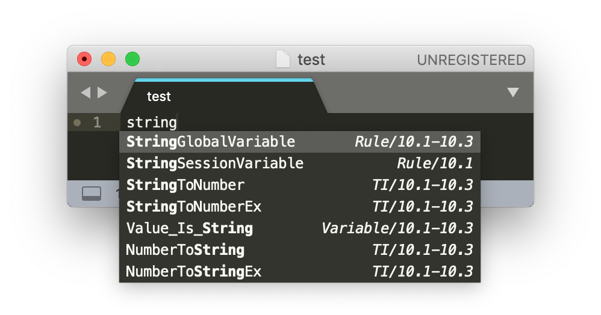

# *Tm1SublimeCodeCompletion* for Sublime
*IBM Cognos TM1 code completion for Sublime Text editor.*

## Installation

This package was tested on Sublime Text editor version 3. You can download it here: [Sublime](https://www.sublimetext.com/3).

To install it, you need to do the following:

1. Install one of Sublime **packages for highlighting** TM1 code, for example [hermie64/tm1-sublime](https://github.com/hermie64/tm1-sublime);
2. Download **Tm1SublimeCodeCompletion.sublime-completions** file from this repository;
3. Put it in **Package** folder of your Sublime Text editor. For quick access use:
   * *Windows* – Preferences > Browse Packages
   * *Mac OS* – Sublime Text > Preferences > Browse packages
4. You are ready!

To make it work: choose **TM1** syntax for current document (from *View* menu or bottom right corner), start typing function name. Everything should work!

## Features

* Packages contain functions and variables definitions for Cognos TM1 from 10.1 upto 10.3 (Planning Analitycs) versions;

* Package contains definitions for different Cognos TM1 environments: TI, Rules, Perspectives, Excel Macro functions and etc;

* When you type you will see information about environment and version of Cognos, where you can use this function/variable in right side of the popup menu:

   

* All definitions was taken from official [IBM documentation](https://www.ibm.com/support/knowledgecenter/en/SS9RXT_10.2.2/com.ibm.swg.ba.cognos.ctm1.doc/welcome.html).
